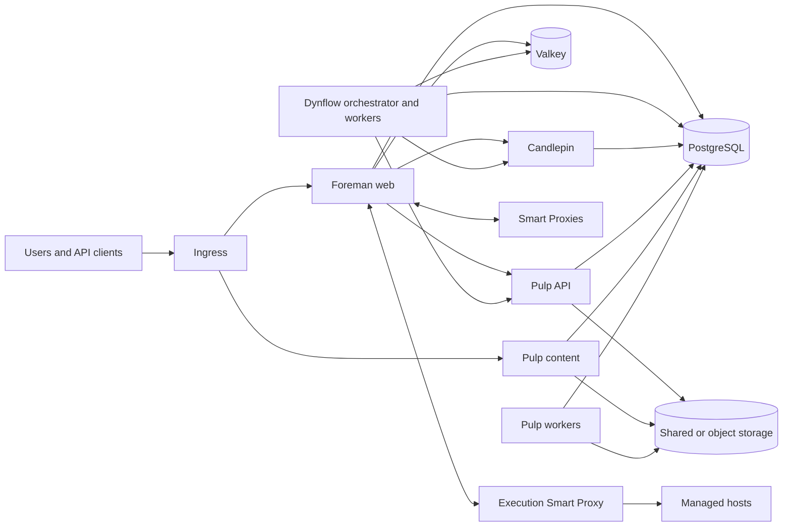

# Architecture

Foreman on Kubernetes uses a Helm chart named `foreman` to deploy the
published Foreman, Candlepin, and Pulp container images together. Foreman runs
in its own application workload; Candlepin and Pulp run as separate services.

## Goals

- deploy published application images without forks or a Kubernetes-specific
  application mode
- keep application pods stateless by storing persistent data outside the
  containers
- scale web and worker processes only where they support multiple replicas
- make each component's supported capabilities and operational limitations
  explicit
- keep infrastructure-facing services close to the networks they manage

## Non-goals

- replacing the application repositories or their release processes
- owning the lifecycle, availability, or backup policy of PostgreSQL, Valkey,
  or object storage
- enabling multiple replicas for components that support only one active
  instance

## Topology

PostgreSQL, Valkey, and Pulp content storage are drawn once for readability.
Production deployments may use separate databases or Valkey instances for
failure isolation and independent lifecycle policies.

## Workloads

### Foreman

The [Foreman container image](https://github.com/theforeman/foreman-oci-images)
defines its plugins and runtime dependencies. This deployment uses that image
without changing its contents.

The Foreman image runs in four long-lived Deployments:

- the Foreman web Deployment serves the user interface and API
- one Dynflow orchestrator Deployment coordinates task execution
- a Dynflow worker Deployment executes general tasks
- a Dynflow hosts-queue worker Deployment executes host-specific tasks

The web and worker Deployments have independent replica settings. Recurring
Foreman tasks run as CronJobs instead of in the web pods.

### Candlepin

Candlepin runs as a separate Deployment and Service with one replica because
its runtime uses an embedded messaging broker. A pod or node failure interrupts
Candlepin until Kubernetes recreates the pod.

### Pulp

Pulp runs separate API, content, and worker Deployments. API and content have
independent replica settings, while workers use a separate fixed replica count.

All Pulp pods share the same database, credentials, and content store. The
content store is configured as shared filesystem storage or an S3-compatible
object store.

### Smart Proxy

Smart Proxies remain independent services. DHCP, DNS, TFTP, BMC, and isolated
provisioning-network access stay on proxies that can reach those networks. A
deployment can register multiple proxies and associate each subnet, location,
or organization with the appropriate one.

A separate Helm chart named `foreman-execution-proxy` runs Remote Execution SSH
and Ansible in a Deployment with its own identity, persistent state, and
target-network access. It is the Execution Smart Proxy shown in the topology
diagram.

## Installation and orchestration

The Helm charts are the direct installation interface. Users can render,
inspect, install, and upgrade them with Helm.

An optional `ForemanRelease` controller can manage the same charts. It validates
a tested set of image versions, prevents concurrent release changes, runs
dependency checks and database migrations before workload updates, and records
progress across controller restarts. Users that do not install the controller
perform those lifecycle steps through the documented Helm workflow.

Application behavior and reusable container capabilities belong in the
component repositories. This repository owns their Kubernetes packaging,
release ordering, and Kubernetes-specific validation.

## State and lifecycle

Durable data and shared runtime state live outside the Foreman, Candlepin, and
Pulp pods in PostgreSQL, Valkey, the configured Pulp content store, and mounted
persistent volumes. Certificates and credentials are mounted from Kubernetes
Secrets. The cluster operator is responsible for the availability, backups,
and recovery of these stores.

Database schema migrations run as Kubernetes Jobs before new application pods
are rolled out. A failed migration stops the rollout. The deployment does not
automatically restore the previous database state.

## Scaling and availability

Replica counts are configured independently for the Foreman web, Dynflow worker,
Dynflow hosts-queue worker, Pulp API, Pulp content, and Pulp worker Deployments.
The Dynflow orchestrator and Candlepin remain fixed at one replica.

By default, the `foreman` Helm chart creates disruption budgets and topology
spread constraints for supported replicated workloads. Both controls can be
disabled through chart values. They preserve existing replicas during
maintenance but do not make a single-replica component highly available.
